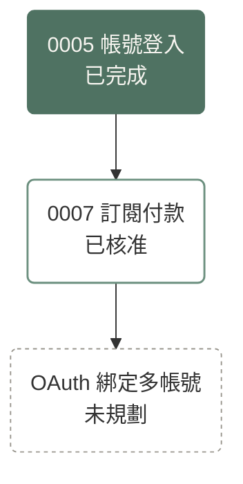

# Spec-Driven Development

Every change starts from a document; code follows. This skill defines how.

## Document Model

| Path | Contains | Does Not Contain (Belongs In) |
| --- | --- | --- |
| `docs/specs/product.md` | Positioning, target users, scope, non-goals, glossary | Behavior requirements (capability spec); technical choices (`architecture.md`); feature timelines (`roadmap.md`) |
| `docs/specs/architecture.md` | Current technical architecture, with inline rationale | User-visible behavior (capability spec); planned architecture (plan); full decision discussions (archived plan) |
| `docs/specs/<capability>.md` | Implemented behavior of one product capability | Planned behavior (plan's "Spec 變更"); technical structure (`architecture.md`); implementation details such as tables, classes, libraries (code) |
| `docs/plans/NNNN-slug.md` | An approved change not yet merged | Step-by-step implementation (left to the implementer); test names and manual check steps (implementation PR) |
| `docs/plans/archive/NNNN-slug.md` | Done or abandoned plans | Any edit after archiving; current behavior (specs) |
| `docs/plans/roadmap.md` | Dependency graph, plus vision for unfinished features | Detailed requirements (the stage's plan); `draft` and `in-progress` work (open PRs); finished features' descriptions (specs) |

Specs on the `main` branch describe only what the code on `main` implements. Future behavior lives in a plan's "Spec 變更" section and enters the spec in the same PR as the code that implements it.

Archived plans are history. Never treat them as current guidance; read them only to understand why something is the way it is.

## Pick the Tier

1. **Tier 1**: the change alters behavior a spec describes (or should describe), alters architecture, or adds a spec file. A bug in a case no spec covers is a spec gap, so it is Tier 1. Use the `plan` and `implement` procedures.
2. **Tier 2**: behavior-preserving but non-trivial: a bug fix that restores spec'd behavior, a refactor, a performance change, dev tooling or CI config, a minor or major dependency bump. Use the `change` procedure.
3. **Tier 3**: on the trivial whitelist below. No plan and no PR template; open a PR once the user instructs a push. The whitelist is exhaustive:
   - Typos, punctuation, and formatter output.
   - Comment-only changes.
   - Patch-level dependency bumps.
   - Doc-only fixes that make `docs/specs/` match current code. Never add new behavior this way.
   - Roadmap vision edits and new `unplanned` nodes.
   - Edits to AGENTS.md and to this skill.

When unsure, take the higher tier.

## Rules That Apply Everywhere

- Never push to `main`. Never merge a PR. The user merges; a merge is the user's approval.
- Commit and push only when the user explicitly instructs it. When a procedure step below reaches a commit, a push, or a PR action that needs one, stop, tell the user what is ready, and wait. Opening a PR needs a push, so it waits too.
- Assign every PR you open to the user who directed the work: `gh pr create --assignee @me`, which resolves to the account `gh` is logged in as. If `gh` is logged in as a bot or someone other than that user, ask the user who to assign.
- Every time you push new content to a branch that has an open PR, check whether the PR title and description still match the branch's latest state, and update them if they do not.
- Right before every update to a PR title or description, fetch the current version from GitHub (`gh pr view <number> --json title,body`) and apply your edits on top of it, no matter how well you remember what you last wrote. Other people may be editing the same PR at the same time.
- A plan's frontmatter `status` is the source of truth. Whenever a status changes, update `roadmap.md` in the same PR. Change statuses only through the procedures below.
- Never edit positioning, target users, scope, or non-goals in `product.md` unless the user explicitly asks. If a plan would conflict with `product.md`, stop and tell the user. Glossary additions or changes go in the plan's "Spec 變更" section.
- After every implementation PR merges, `main` must work. Hide unfinished features behind a feature flag. There is no size cap on a plan; split by what can ship on its own.
- These rules constrain PR content, not commit structure. Humans may commit on any branch; number and order of commits do not matter.
- Language: specs, plans, roadmap and PR descriptions are written in Traditional Chinese (Taiwan usage). PR titles, filenames, frontmatter keys and values, requirement IDs, branch names and Mermaid node IDs are English.

## Plan Statuses

| Status | Where it is represented |
| --- | --- |
| `unplanned` | A roadmap node only; no plan file exists |
| `draft` | An open `[plan NNNN]` PR; never written in a file |
| `approved` | A plan file on `main`. The plan PR writes `approved` from the start; merging the PR is the approval |
| `in-progress` | An open `[impl NNNN]` PR; never written in a file |
| `done` | An archived plan file; set inside the implementation PR |
| `abandoned` | An archived plan file; set by the `abandon` procedure |

## Procedure: Plan

1. Read `product.md`, `architecture.md`, every affected spec, `roadmap.md`, and the output of `gh pr list --state open`.
2. Pick the ID: take the highest `NNNN` across `docs/plans/**/*.md` and open PR titles (`[plan NNNN]`, `[impl NNNN]`), then add 1. If two plans end up with the same ID, the one merged later renumbers.
3. Create branch `plan/NNNN-slug` from up-to-date `main`.
4. Copy `templates/plan.md` to `docs/plans/NNNN-slug.md` and fill it in:
   - `specs` lists every spec file the plan touches; `depends_on` lists plan IDs that must be `done` first.
   - "Spec 變更" refers to requirements by ID, grouped by spec file. Write new requirements in full, in the spec format.
   - Every decision ends with a "併入" line naming where its 1 to 3 line summary goes, or "無". Promote a decision to a spec only if a future agent reading the spec would plausibly re-propose the rejected option.
   - "做法要點" covers only what the user must know before approving: architecture impact, and risky or hard-to-reverse operations (data migration, breaking changes, deploy order). No step-by-step implementation list.
   - "驗證方式" marks every scenario of every added or modified requirement with how it will be verified: `unit`, `integration`, `e2e`, or `手動`. Do not name tests or write manual steps; the implementation does not exist yet. Manual steps go in the implementation PR.
   - "還沒定案的問題" must be empty before asking the user to merge. Ask the user about anything left there.
5. Update `roadmap.md` (see "Roadmap Conventions"): add the node as `approved`, or rename the matching `unplanned` node to `PNNNN`; add edges from `depends_on`; link the plan from the feature's vision section.
6. Tell the user the plan is ready and wait. When the user instructs a push, commit, push, and open the PR. Title: `[plan NNNN] <English title>`. Body: the plan's "目標" paragraph and a link to the plan file. Then stop and wait for the user to merge.

## Procedure: Implement <id>

Preconditions: `docs/plans/NNNN-*.md` exists on `main` with `status: approved`, and every plan in `depends_on` is archived as `done`. Otherwise stop and tell the user.

1. Create branch `impl/NNNN-slug` from up-to-date `main`. On the first push the user instructs, open a draft PR. Title: `[impl NNNN] <English title>`. Body: `templates/pr-impl.md`.
2. Apply the plan's spec changes to the spec files first, then write code against the updated specs.
3. If the plan turns out wrong, change the plan and specs in this PR and keep going. Record every deviation in the PR body under "與 Plan 不同的地方", split into "行為改變" and "實作細節".
4. Run all automated tests and make them pass. Then review your own diff against the plan's "驗證方式": every scenario marked for automated testing must have a test at the stated level; add any that are missing. In the PR body's "手動檢查", write one checklist item per scenario marked `手動` in the plan, no more and no fewer, each with concrete steps against the actual implementation and the expected result taken from the scenario. Run every check you can (start the app, call the API, drive a browser) and tick it only when it passes; fix failures before moving on. Leave a check unticked only if you cannot run it, and state why under the item so the user can run it. If manual checks change during implementation, update the plan's "驗證方式" in this PR first and note it under "與 Plan 不同的地方". Do not list automated tests or their results in the PR body; reviewers read the tests themselves, and CI reports results.
5. Before marking the PR ready, make sure it contains all of the following:
   - Every spec change, including deviations.
   - The code.
   - Every decision with a "併入" target, summarized in 1 to 3 lines next to the related requirement or architecture section, linking to the plan's archive path.
   - The architecture impact from "做法要點", reflected in `architecture.md`.
   - The plan with `status: done`, moved to `docs/plans/archive/`.
   - `roadmap.md` with the node switched to `done` and the vision section's link pointing to the archive path. If every stage of that feature is now done, remove the feature's vision section; keep its nodes in the graph.
6. Tell the user the work is ready and stop. When the user instructs a push, commit, push, and run `gh pr ready`. Do not merge.

## Procedure: Change

1. Create branch `change/slug` from up-to-date `main`. Before writing any code, fill in `templates/pr-change.md` ("問題", "原因", "做法", "驗證方式") as the PR description and show it to the user. On the first push the user instructs, open a draft PR with it.
2. Implement. If the change turns out to alter spec'd behavior, stop: it is Tier 1.
3. Run all automated tests and make them pass. Complete the manual checklist in "驗證方式" the same way as step 4 of "Procedure: Implement". Tell the user the work is ready and stop. When the user instructs a push, commit, push, and run `gh pr ready`.

## Procedure: Abandon <id>

- If the plan exists only in an open `[plan NNNN]` PR, close that PR. Nothing else changes.
- If the plan is on `main`:
  1. Close any open `[impl NNNN]` PR.
  2. Create branch `abandon/NNNN-slug`. Set `status: abandoned`, add one line under the title stating why and which plan replaces it (if any), and move the file to `docs/plans/archive/`.
  3. In `roadmap.md`, remove the node and its edges, reconnect dependents to the replacing plan if there is one, and update the vision section.
  4. Tell the user the change is ready and wait. When the user instructs a push, commit, push, and open a PR titled `[abandon NNNN] <English title>`; then stop.

## Roadmap Conventions

`roadmap.md` has two sections: "總覽" holds one Mermaid graph for the whole project; "功能願景" holds one subsection per unfinished feature.

````markdown

````

- Use `flowchart TD`. Do not group nodes into subgraphs, because a plan can span several features.
- Node IDs: `PNNNN` for plans; a temporary snake_case ID for unplanned stages, renamed to `PNNNN` once a plan exists.
- Use rounded nodes, `("...")`, never square `["..."]`.
- Labels carry the status as text as well as color: `已完成`, `已核准`, `未規劃`.
- Copy the three `classDef` lines above verbatim; do not change colors or add classes. They are tuned for both GitHub light and dark themes. Fill level shows progress: dashed outline, solid outline, solid fill.
- `A --> B` means B depends on A.
- Keep `done` nodes permanently. Remove `abandoned` nodes when the plan is archived.
- A vision subsection states the feature's goal and scope, then lists its stages in order, linking each stage that has a plan. Keep it at the level of goals and stages; details belong in the stage's plan when it is written. Remove the subsection when every stage is done.
- If the graph becomes hard to read, collapse each finished feature into one node in a Tier 3 PR.

## Spec Conventions

- One spec file per product capability that a user would recognize (`auth.md`, `billing.md`), not per page or technical module. Split a file into smaller capabilities when it grows too large.
- The frontmatter declares `prefix` (for example `AUTH`). Never change it, even if the file is renamed or split, so existing IDs stay valid.
- Requirement format: see `templates/spec.md`. IDs are `<PREFIX>-R<n>` and are never reused, even after removal.
- Rationale sits next to the requirement or architecture section it explains: 1 to 3 lines with the reason and the rejected options, linking to the archived plan. Behavior trade-offs go in the capability spec; technical trade-offs go in `architecture.md`.
