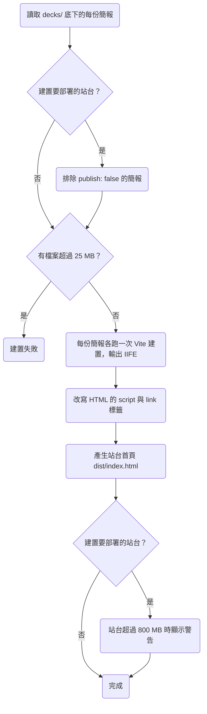

# 0001 專案地基：工具鏈與可播放的骨架

## 目標

完成後，repo 有一套可以開發、測試、部署的工具鏈，以及一個最小可行的骨架：`decks/` 底下的每份簡報都會建置成一個簡報包，不論是部署在 GitHub Pages、在本機用 static server 開啟，還是在沒有網路的電腦上直接雙擊 `index.html`，簡報包都能播放，站台首頁則列出所有發布的簡報。

## 範圍

- 要做：
  - 安裝 Vite、React、TypeScript、Tailwind CSS、ESLint、Prettier、Vitest、Playwright，並完成設定。
  - 在 `Makefile` 提供開發、建置、檢查、測試的指令。
  - 設定 GitHub Actions：PR 上跑 lint、型別檢查、測試與建置，merge 到 `main` 後部署到 GitHub Pages。
  - 建立多份簡報的建置流程、站台首頁，以及 `file://` 相容的打包。
  - 建立一份範例簡報，只有一頁，頁面上有一張圖片。
  - 寫好 `architecture.md`、英文的 `README.md`、`product.md` 的術語表，並新增 `playback.md`、`distribution.md` 兩份 spec。
- 刻意不做的事：
  - 換頁、頁內分步、講者模式等播放器功能。範例簡報只有一頁，換頁留給之後的 plan。
  - 主題、版型元件與字型打包。
  - ECharts、Mermaid、Shiki、KaTeX 這些顯示特定內容類型用的套件，等到各自的功能 plan 再安裝。

## Spec 變更

### product.md

- 術語表新增簡報、頁、畫布、簡報包、站台。定位、目標使用者、範圍與刻意不做的事已經依專案擁有者的要求，在本 plan 的 PR 直接寫入。

#### 術語表

| 術語 | 定義 |
| --- | --- |
| 簡報 | `decks/` 底下的一個目錄，包含簡報設定檔 `deck.json` 與每一頁的 TSX 檔。 |
| 頁 | 簡報播放時的一個畫面，對應一個 TSX 檔。 |
| 畫布 | 頁面排版用的 1920×1080 座標空間，播放時整個畫布等比縮放到螢幕上。 |
| 簡報包 | 一份簡報建置出來的目錄，裡面有播放這份簡報所需的全部檔案。 |
| 站台 | 部署到 GitHub Pages 的整個網站，包含首頁與所有發布的簡報包。 |

### playback.md

新增這份 spec，`prefix` 為 `PLAY`，開頭的說明寫成：「播放是講者開啟一份簡報，並在螢幕上顯示各頁的能力。」

- 新增 PLAY-R1 開啟簡報時顯示第一頁
- 新增 PLAY-R2 畫布等比縮放

#### PLAY-R1 開啟簡報時顯示第一頁

開啟一份簡報時，畫面顯示 `deck.json` 頁面順序裡的第一頁。

- 情境：開啟簡報
  - 前提：`deck.json` 依序列出 `intro`、`agenda` 兩頁
  - 動作：開啟這份簡報
  - 結果：畫面顯示 `intro` 這一頁

#### PLAY-R2 畫布等比縮放

畫布等比縮放到瀏覽器視窗能容納的最大尺寸並置中，畫布以外的區域顯示黑色。

- 情境：視窗比例是 16:9
  - 前提：瀏覽器視窗是 1280×720
  - 動作：開啟簡報
  - 結果：畫布縮放成 1280×720，畫面沒有黑邊
- 情境：視窗比例是 4:3
  - 前提：瀏覽器視窗是 1024×768
  - 動作：開啟簡報
  - 結果：畫布縮放成 1024×576，上下各有 96px 的黑邊
- 情境：視窗大小改變
  - 前提：簡報開啟在 1280×720 的視窗
  - 動作：把視窗改成 1920×1080
  - 結果：畫布縮放成 1920×1080，頁面上每個元素在畫布裡的相對位置不變

### distribution.md

新增這份 spec，`prefix` 為 `DIST`，開頭的說明寫成：「講者用這項能力把簡報建置成可以帶到任何場地播放的簡報包，並把發布的簡報部署成站台。」

- 新增 DIST-R1 每份簡報建置成一個簡報包
- 新增 DIST-R2 直接開啟檔案就能播放
- 新增 DIST-R3 站台首頁列出發布的簡報
- 新增 DIST-R4 站台部署在子路徑下也能播放
- 新增 DIST-R5 不發布的簡報不進站台
- 新增 DIST-R6 單一檔案超過 25 MB 時建置失敗
- 新增 DIST-R7 站台超過 800 MB 時顯示警告

#### DIST-R1 每份簡報建置成一個簡報包

建置時，`decks/` 底下的每份簡報各自輸出成一個簡報包，播放時瀏覽器只讀取簡報包裡的檔案。

- 情境：離線播放
  - 前提：簡報包已經建置好，電腦沒有網路連線
  - 動作：用 static server 開啟簡報包的 `index.html`
  - 結果：畫面顯示第一頁，樣式與圖片都已載入，瀏覽器沒有對簡報包以外的位置送出 request

#### DIST-R2 直接開啟檔案就能播放

用瀏覽器直接開啟簡報包裡的 `index.html`（`file://` URL）時，畫面顯示 `deck.json` 頁面順序裡的第一頁，樣式與圖片都已載入。

- 情境：在 Chromium 開啟
  - 前提：簡報包已經建置好
  - 動作：在 Chromium 開啟 `index.html`
  - 結果：畫面顯示第一頁，樣式與圖片都已載入
- 情境：在 Firefox 開啟
  - 前提：簡報包已經建置好，Firefox 使用預設的安全設定
  - 動作：在 Firefox 開啟 `index.html`
  - 結果：畫面顯示第一頁，樣式與圖片都已載入
- 情境：在 WebKit 開啟
  - 前提：簡報包已經建置好
  - 動作：在 WebKit 開啟 `index.html`
  - 結果：畫面顯示第一頁，樣式與圖片都已載入
- 情境：在 Safari 開啟
  - 前提：簡報包已經建置好
  - 動作：在 macOS 的 Safari 開啟 `index.html`
  - 結果：畫面顯示第一頁，樣式與圖片都已載入
- 情境：簡報包搬到其他目錄
  - 前提：簡報包已經建置好
  - 動作：把簡報包複製到另一個目錄，再開啟其中的 `index.html`
  - 結果：畫面顯示第一頁，樣式與圖片都已載入

#### DIST-R3 站台首頁列出發布的簡報

站台首頁列出所有發布的簡報標題，點選標題會開啟那份簡報。

- 情境：列出簡報
  - 前提：`decks/` 底下有兩份發布的簡報
  - 動作：開啟站台首頁
  - 結果：首頁列出兩份簡報的標題
- 情境：從首頁開啟簡報
  - 前提：首頁列出一份標題為「範例」的簡報
  - 動作：點選「範例」
  - 結果：開啟這份簡報，畫面顯示第一頁

#### DIST-R4 站台部署在子路徑下也能播放

站台部署在網域的子路徑下（例如 `https://bingyangchen.github.io/diapo/`）時，首頁與每份簡報都能正常開啟。

- 情境：在子路徑下開啟
  - 前提：站台的檔案放在 static server 的 `/diapo/` 路徑下
  - 動作：開啟 `/diapo/`，再點選一份簡報
  - 結果：首頁列出簡報標題，點選後畫面顯示那份簡報的第一頁
- 情境：部署到 GitHub Pages
  - 前提：建置流程的變更已經 merge 到 `main`
  - 動作：等 GitHub Actions 部署完成後，開啟 `https://bingyangchen.github.io/diapo/`，再點選一份簡報
  - 結果：首頁列出簡報標題，點選後畫面顯示那份簡報的第一頁

#### DIST-R5 不發布的簡報不進站台

`deck.json` 把 `publish` 設成 `false` 的簡報（沒有設定時視為 `true`），不會出現在部署到站台的檔案與首頁裡，在本機建置時則照常建置。

- 情境：部署時排除
  - 前提：一份簡報的 `deck.json` 設定 `publish: false`
  - 動作：建置要部署的站台
  - 結果：站台的檔案裡沒有這份簡報的簡報包，首頁也沒有列出這份簡報
- 情境：本機建置時保留
  - 前提：一份簡報的 `deck.json` 設定 `publish: false`
  - 動作：在本機建置
  - 結果：產生這份簡報的簡報包，首頁也列出這份簡報
- 情境：沒有設定 publish
  - 前提：一份簡報的 `deck.json` 沒有 `publish` 欄位
  - 動作：建置要部署的站台
  - 結果：站台包含這份簡報的簡報包，首頁也列出這份簡報

> 設計理由：GitHub Free 只能從 public repo 發布 Pages，而 private repo 發布出去的 Pages 仍然是公開網站，只有 Enterprise Cloud 能限制存取，所以目前所有簡報都公開部署。之後有不能公開的簡報時，把 repo 改成 private，再設定 `publish: false`。曾考慮部署到有存取控制的主機，例如 Cloudflare Pages 搭配 Cloudflare Access，目前沒有需要保密的簡報，所以不採用。完整討論見 [0001](../plans/archive/0001-project-foundation.md)。

#### DIST-R6 單一檔案超過 25 MB 時建置失敗

簡報目錄裡任何一個檔案超過 25 MB 時建置失敗，錯誤訊息寫出檔案路徑與大小。

- 情境：檔案超過上限
  - 前提：簡報目錄裡有一個 26 MB 的影片檔
  - 動作：建置
  - 結果：建置失敗，錯誤訊息寫出影片檔的路徑與大小
- 情境：檔案剛好在上限內
  - 前提：簡報目錄裡最大的檔案是 25 MB
  - 動作：建置
  - 結果：建置成功

> 設計理由：圖片、影片等素材直接 commit 進 git。不論素材有沒有用 Git LFS 存放，GitHub Pages 的站台上限都是 1 GB，而且每次部署時 GitHub Actions 下載 Git LFS 的檔案都會消耗 Git LFS 的頻寬額度，所以不採用 Git LFS。單檔上限定在 25 MB，是因為 Cloudflare Pages 的單檔上限也是 25 MB，之後站台超過 1 GB 要換主機時，所有素材都能直接搬過去。完整討論見 [0001](../plans/archive/0001-project-foundation.md)。

#### DIST-R7 站台超過 800 MB 時顯示警告

建置要部署的站台時，如果站台的檔案總共超過 800 MB，建置照常完成，但會顯示警告，寫出站台的總大小與 GitHub Pages 的 1 GB 上限。

- 情境：站台超過 800 MB
  - 前提：所有發布的簡報包加起來是 850 MB
  - 動作：建置要部署的站台
  - 結果：建置成功，並顯示警告
- 情境：站台在 800 MB 以內
  - 前提：所有發布的簡報包加起來是 100 MB
  - 動作：建置要部署的站台
  - 結果：建置成功，沒有警告

## 決策

### 每頁的撰寫格式

- 選項：每頁是一個 React 元件（TSX），用 Vite 建置；每頁是一份獨立的 HTML，由播放器用 iframe 載入；每頁是一段 HTML 片段，由播放器注入 Shadow DOM。
- 取捨：用 iframe 時，預覽總覽要同時開幾十個 iframe，播放器也只能透過 `postMessage` 控制頁內分步。HTML 片段裡的 `<script>` 不會自動執行，而且沒有型別檢查，AI 寫錯了要開瀏覽器才發現。
- 結論：TSX 搭配 Vite。製作簡報時需要建置，播放時用的都是建置好的靜態檔。
- 併入：architecture.md#技術選型

### 簡報放在哪裡

- 選項：所有簡報放在本 repo 的 `decks/`；框架發布成 npm 套件，每份簡報各自一個 repo；框架一個 repo，簡報集中放在另一個 repo。
- 結論：放在本 repo 的 `decks/`。改框架時，型別檢查會一起檢查所有簡報。
- 併入：architecture.md#模組劃分

### 怎麼讓簡報包在 `file://` 下播放

- 選項：輸出 IIFE 格式的 script，再改寫 Vite 產生的 HTML 標籤；用 `vite-plugin-singlefile` 把所有檔案內嵌進一個 HTML。
- 取捨：在 Chromium、Firefox、WebKit 實測過，從 `file://` 開啟的網頁 origin 是 `null`，所以外部的 `<script type="module">`、`import()`、`fetch()`，以及帶 `crossorigin` 屬性的 script 與 stylesheet 都會被擋下，Vite 預設的輸出因此無法播放。`vite-plugin-singlefile` 會把影片轉成 base64 塞進 HTML。IIFE 格式不能使用 `import.meta` 與 top-level await，也不能做 code splitting。
- 結論：輸出 IIFE，並在建置的最後一步把 `<script type="module" crossorigin>` 改成 `<script defer>`，同時移除 stylesheet 的 `crossorigin` 屬性。
- 併入：architecture.md#部署方式

### 頁面尺寸

- 選項：固定 1920×1080 畫布，整頁等比縮放；響應式版面；固定畫布，再加上簡報層級的比例設定。
- 取捨：響應式版面讓同一頁在不同螢幕上的換行位置不同，跑版要到現場才會發現。
- 結論：固定 1920×1080 畫布，比例不合的部分顯示黑邊。之後真的需要 4:3 的簡報時，再加比例設定。
- 併入：playback.md#PLAY-R2

### 站台要不要限制存取

- 選項：所有簡報公開部署到 GitHub Pages；部署到有存取控制的主機。
- 結論：公開部署，並提供 `publish` 欄位，讓之後不能公開的簡報可以排除在站台外。
- 併入：distribution.md#DIST-R5

### 大型素材怎麼存

- 選項：直接 commit 進 git，並設定單檔上限；用 Git LFS；不放進 git。
- 結論：直接 commit 進 git，單檔上限 25 MB。
- 併入：distribution.md#DIST-R6

### 樣式寫法

- 選項：Tailwind CSS 搭配版型元件；CSS Modules；只透過框架元件的 props 設定樣式。
- 取捨：CSS Modules 讓 AI 每改一頁都要讀寫兩個檔案。只用 props 的話，框架要設計一整套樣式 API，並把用法寫進 skill，而 skill 每次載入時，這段說明都會增加 LLM token 的用量。
- 結論：Tailwind CSS。主流模型都熟悉 Tailwind，skill 不必說明樣式怎麼寫。
- 併入：architecture.md#技術選型

### 開發工具鏈

- 選項：Lint 與格式化用 ESLint 搭配 Prettier；改用 Biome。
- 結論：ESLint 搭配 Prettier，外掛的選擇比 Biome 多。其餘工具為 pnpm、Vitest、Playwright，Node 固定在 24 版，所有指令從 `Makefile` 執行。
- 併入：architecture.md#技術選型

### 頁面順序存在哪裡

- 選項：`deck.json` 用 slide ID 的陣列記錄順序；用檔名的編號前綴決定順序。
- 取捨：用編號前綴時，每次調整順序都要改好幾個檔名，之後在預覽總覽拖曳排序時，dev server 也要一次改名好幾個檔案。
- 結論：`deck.json` 記錄順序，每頁的 TSX 檔以 slide ID 命名。
- 併入：architecture.md#模組劃分

## 做法要點

目錄結構如下，`src/` 裡的程式碼由所有簡報共用。

```text
decks/
  <deck-id>/
    deck.json            標題、publish、頁面順序
    slides/<slide-id>.tsx
    assets/              圖片、影片等素材
src/                     播放器、框架、Vite plugin
e2e/                     Playwright 測試
dist/                    建置產物
  index.html             站台首頁
  <deck-id>/             簡報包
```

建置流程如下。本機建置與建置要部署的站台走同一條流程，差別只在要部署時會排除不發布的簡報，並檢查站台的總大小。



- 每份簡報各跑一次 Vite 建置，所以簡報包之間不共用任何檔案，任何一個簡報包都能單獨複製到隨身碟。
- `make dev` 用 Vite 的 dev server 透過 HTTP 載入 ES module，和建置產物的載入方式不同，所以 `file://` 相容性只能在建置產物上驗證，E2E 測試一律測建置產物。
- Playwright 內建的 Firefox 預設把 `security.fileuri.strict_origin_policy` 設成 `false`，和真正的 Firefox 相反。E2E 測試要把這個設定改回 `true`，Firefox 的 `file://` 測試結果才會和真正的 Firefox 一致。
- `architecture.md` 會記下在 Chromium、Firefox、WebKit 實測過的 `file://` 行為，讓之後的 plan 不必重新查證：外部 module script、`import()`、`fetch()` 與帶 `crossorigin` 的標籤會被擋下；字型用相對路徑可以載入；`localStorage` 在 Chromium 與 WebKit 由所有 `file://` 網頁共用，在 Firefox 則每個檔案路徑各自一份；兩個視窗之間用 `window.open` 加 `postMessage` 可以通訊，`BroadcastChannel` 在 WebKit 收不到訊息。
- 部署用 GitHub Actions 的 Pages 部署流程，專案擁有者已經把 Pages 的來源設成 GitHub Actions。站台會在實作 PR merge 到 `main` 後第一次部署。

## 驗證方式

| 需求 | 驗證方式 |
| --- | --- |
| PLAY-R1 情境：開啟簡報 | e2e |
| PLAY-R2 情境：視窗比例是 16:9 | e2e |
| PLAY-R2 情境：視窗比例是 4:3 | e2e |
| PLAY-R2 情境：視窗大小改變 | e2e |
| DIST-R1 情境：離線播放 | e2e |
| DIST-R2 情境：在 Chromium 開啟 | e2e |
| DIST-R2 情境：在 Firefox 開啟 | e2e |
| DIST-R2 情境：在 WebKit 開啟 | e2e |
| DIST-R2 情境：在 Safari 開啟 | 手動 |
| DIST-R2 情境：簡報包搬到其他目錄 | e2e |
| DIST-R3 情境：列出簡報 | e2e |
| DIST-R3 情境：從首頁開啟簡報 | e2e |
| DIST-R4 情境：在子路徑下開啟 | e2e |
| DIST-R4 情境：部署到 GitHub Pages | 手動 |
| DIST-R5 情境：部署時排除 | integration |
| DIST-R5 情境：本機建置時保留 | integration |
| DIST-R5 情境：沒有設定 publish | integration |
| DIST-R6 情境：檔案超過上限 | unit |
| DIST-R6 情境：檔案剛好在上限內 | unit |
| DIST-R7 情境：站台超過 800 MB | unit |
| DIST-R7 情境：站台在 800 MB 以內 | unit |

## 還沒定案的問題

無
