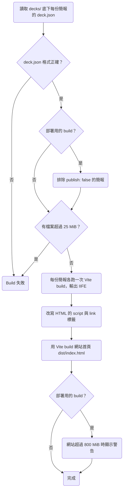

# 0001 專案地基：工具鏈與可播放的骨架

## 目標

完成後，repo 有一套可以開發、測試、部署的工具鏈，以及一個最小可行的骨架：`decks/` 底下的每份簡報都會 build 成一個 slidetray，不論是部署在 GitHub Pages、在本機用 static server 開啟，還是在沒有網路的電腦上直接用瀏覽器開啟 `index.html`，slidetray 都能播放，網站首頁則列出所有發布的簡報。

## 範圍

- 要做：
  - 安裝 Vite、React、TypeScript、Tailwind CSS、ESLint、Prettier、Vitest、Playwright，並完成設定。
  - 在 `Makefile` 提供開發、build、檢查、測試的指令。
  - 設定 GitHub Actions：PR 上跑 lint、型別檢查、unit test 與 integration test、部署用的 build 與 E2E test，merge 到 `main` 後部署到 GitHub Pages。
  - 建立多份簡報的 build 流程、網站首頁，以及 `file://` 相容的打包。
  - 建立一份範例簡報，只有一頁，頁面上有一張圖片。
  - 寫好 `architecture.md`、英文的 `README.md`、`product.md` 的術語表，並新增 `playback.md`、`distribution.md`、`framework.md` 三份 spec。
- 刻意不做的事：
  - 換頁、頁內分步、講者模式等播放器功能。範例簡報只有一頁，換頁留給之後的 plan。
  - 主題、版型元件與字型打包。
  - ECharts、Mermaid、Shiki、KaTeX 這些顯示特定內容類型用的套件，等到各自的功能 plan 再安裝。

## Spec 變更

### product.md

- 術語表新增畫布、`deck.json`。

#### 術語表

| 術語 | 定義 |
| --- | --- |
| 畫布 | 頁面排版用的 1920×1080 座標空間，播放時整個畫布等比縮放到螢幕上。和 HTML 的 `<canvas>` 元素無關。 |
| `deck.json` | 每份簡報的設定檔，放在簡報目錄裡，記錄簡報標題、是否發布到網站，以及頁面順序。 |

### playback.md

新增這份 spec，`prefix` 為 `PLAY`，開頭的說明寫成：「播放是講者開啟一份簡報，並在螢幕上顯示各頁的能力。」

- 新增 PLAY-R1 開啟簡報時顯示第一頁
- 新增 PLAY-R2 畫布等比縮放
- 新增 PLAY-R3 瀏覽器分頁顯示簡報標題

#### PLAY-R1 開啟簡報時顯示第一頁

開啟一份簡報時，畫面顯示簡報設定檔 `deck.json` 裡頁面順序的第一頁。

- 情境：開啟簡報
  - 前提：`deck.json` 依序列出 `intro`、`agenda` 兩頁
  - 動作：開啟這份簡報
  - 結果：畫面顯示 `intro` 這一頁

#### PLAY-R2 畫布等比縮放

畫布等比縮放到瀏覽器視窗能容納的最大尺寸並置中，畫布以外的區域顯示黑色。

- 情境：視窗比例是 16:9
  - 前提：瀏覽器視窗是 1280×720
  - 動作：開啟簡報
  - 結果：畫布縮放成 1280×720，畫面沒有黑邊
- 情境：視窗比例是 4:3
  - 前提：瀏覽器視窗是 1024×768
  - 動作：開啟簡報
  - 結果：畫布縮放成 1024×576，上下各有 96px 的黑邊
- 情境：視窗大小改變
  - 前提：簡報開啟在 1280×720 的視窗
  - 動作：把視窗改成 1920×1080
  - 結果：畫布縮放成 1920×1080，頁面上每個元素在畫布裡的相對位置不變

#### PLAY-R3 瀏覽器分頁顯示簡報標題

開啟一份簡報時，瀏覽器分頁的標題和 `deck.json` 的 `title` 完全相同。

- 情境：開啟簡報
  - 前提：`deck.json` 的 `title` 是 `年度回顧`
  - 動作：開啟這份簡報
  - 結果：瀏覽器分頁的標題是 `年度回顧`
- 情境：標題含有特殊字元
  - 前提：`deck.json` 的 `title` 是 `Q&A <Live> $$`
  - 動作：開啟這份簡報
  - 結果：瀏覽器分頁的標題是 `Q&A <Live> $$`

### distribution.md

新增這份 spec，`prefix` 為 `DIST`，開頭的說明寫成：「講者用這項能力把簡報 build 成可以帶到任何場地播放的 slidetray，並把發布的簡報部署成網站。Build 分成兩種：本機 build 由講者在自己的電腦上執行；部署用的 build 由 GitHub Actions 在部署到網站之前執行，講者也可以先在本機執行，確認部署的結果。」

- 新增 DIST-R1 每份簡報各有一個 Slidetray
- 新增 DIST-R2 直接開啟檔案就能播放
- 新增 DIST-R3 網站首頁列出發布的簡報
- 新增 DIST-R4 網站部署在子路徑下也能播放
- 新增 DIST-R5 不發布的簡報不出現在網站上
- 新增 DIST-R6 拒絕超過 25 MiB 的單一檔案
- 新增 DIST-R7 網站超過 800 MiB 時顯示警告

#### DIST-R1 每份簡報各有一個 Slidetray

Build 時，`decks/` 底下的每份簡報各自產生一個 slidetray，播放時瀏覽器只讀取這個 slidetray 裡的檔案。

- 情境：離線播放
  - 前提：簡報已經 build 好，電腦沒有網路連線
  - 動作：用 static server 開啟 slidetray 裡的 `index.html`
  - 結果：畫面顯示第一頁，樣式與圖片都已載入，瀏覽器沒有對 slidetray 以外的位置送出 request

#### DIST-R2 直接開啟檔案就能播放

用瀏覽器直接開啟 slidetray 裡的 `index.html`（`file://` URL）時，畫面顯示簡報設定檔 `deck.json` 裡頁面順序的第一頁，樣式與圖片都已載入。

- 情境：在 Chromium 開啟
  - 前提：簡報已經 build 好
  - 動作：在 Chromium 開啟 `index.html`
  - 結果：畫面顯示第一頁，樣式與圖片都已載入
- 情境：在 Firefox 開啟
  - 前提：簡報已經 build 好，Firefox 使用預設的安全設定
  - 動作：在 Firefox 開啟 `index.html`
  - 結果：畫面顯示第一頁，樣式與圖片都已載入
- 情境：在 WebKit 開啟
  - 前提：簡報已經 build 好
  - 動作：在 WebKit 開啟 `index.html`
  - 結果：畫面顯示第一頁，樣式與圖片都已載入
- 情境：在 Safari 開啟
  - 前提：簡報已經 build 好
  - 動作：在 macOS 的 Safari 開啟 `index.html`
  - 結果：畫面顯示第一頁，樣式與圖片都已載入
- 情境：slidetray 搬到其他位置
  - 前提：簡報已經 build 好
  - 動作：把 slidetray 複製到其他位置，再開啟其中的 `index.html`
  - 結果：畫面顯示第一頁，樣式與圖片都已載入

#### DIST-R3 網站首頁列出發布的簡報

網站首頁列出所有發布的簡報標題，點選標題會開啟那份簡報。

- 情境：列出簡報
  - 前提：`decks/` 底下有兩份發布的簡報
  - 動作：開啟網站首頁
  - 結果：首頁列出兩份簡報的標題
- 情境：從首頁開啟簡報
  - 前提：首頁列出一份標題為「範例」的簡報
  - 動作：點選「範例」
  - 結果：開啟這份簡報，畫面顯示第一頁

> 設計理由：網站首頁是講者在現場開啟簡報的入口，也是觀眾在演講後找到簡報的地方。這一版只列出標題，用來驗證網站有入口，以及子路徑下的連結正確；卡片、第一頁預覽與分頁留給 roadmap 的「網站首頁」，因為首頁的設計要沿用之後才會完成的主題。完整討論見 [0001](../plans/archive/0001-project-foundation.md)。

#### DIST-R4 網站部署在子路徑下也能播放

網站部署在網域的子路徑下（例如 GitHub Pages 把 repo 的網站放在 `https://<user>.github.io/<repo>/`）時，首頁與每份簡報都能正常開啟。

- 情境：在子路徑下開啟
  - 前提：網站的檔案放在 static server 的 `/diapo/` 路徑下
  - 動作：開啟 `/diapo/`，再點選一份簡報
  - 結果：首頁列出簡報標題，點選後畫面顯示那份簡報的第一頁
- 情境：部署到 GitHub Pages
  - 前提：網站已經部署到 GitHub Pages
  - 動作：開啟 GitHub Pages 上的網站首頁，再點選一份簡報
  - 結果：首頁列出簡報標題，點選後畫面顯示那份簡報的第一頁

#### DIST-R5 不發布的簡報不出現在網站上

`deck.json` 把 `publish` 設成 `false` 的簡報（沒有設定時視為 `true`），不會出現在部署用的 build 產生的檔案與首頁裡，本機 build 則照常產生這份簡報的 slidetray。

- 情境：部署時排除
  - 前提：一份簡報的 `deck.json` 設定 `publish: false`
  - 動作：執行部署用的 build
  - 結果：網站的檔案裡沒有這份簡報的 slidetray，首頁也沒有列出這份簡報
- 情境：本機 build 時保留
  - 前提：一份簡報的 `deck.json` 設定 `publish: false`
  - 動作：執行本機 build
  - 結果：產生這份簡報的 slidetray，首頁也列出這份簡報
- 情境：沒有設定 publish
  - 前提：一份簡報的 `deck.json` 沒有 `publish` 欄位
  - 動作：執行部署用的 build
  - 結果：網站包含這份簡報的 slidetray，首頁也列出這份簡報

> 設計理由：GitHub Free 只能從 public repo 發布 Pages，而 private repo 發布出去的 Pages 仍然是公開網站，只有 Enterprise Cloud 能限制存取，所以目前所有簡報都公開部署。之後有不能公開的簡報時，把 repo 改成 private，再設定 `publish: false`。曾考慮部署到有存取控制的主機，例如 Cloudflare Pages 搭配 Cloudflare Access，目前沒有需要保密的簡報，所以不採用。完整討論見 [0001](../plans/archive/0001-project-foundation.md)。

#### DIST-R6 拒絕超過 25 MiB 的單一檔案

簡報目錄裡任何一個檔案超過 25 MiB（26,214,400 bytes）時 build 失敗，錯誤訊息寫出檔案路徑與大小。

- 情境：檔案超過上限
  - 前提：簡報目錄裡有一個 26 MiB 的影片檔
  - 動作：Build
  - 結果：Build 失敗，錯誤訊息寫出影片檔的路徑與大小
- 情境：檔案剛好在上限內
  - 前提：簡報目錄裡最大的檔案剛好是 25 MiB
  - 動作：Build
  - 結果：Build 成功

> 設計理由：單檔上限定在 25 MiB，是因為 Cloudflare Pages 的單檔上限也是 25 MiB，之後網站超過 GitHub Pages 的 1 GB 上限、要換主機時，所有素材都能直接搬過去。完整討論見 [0001](../plans/archive/0001-project-foundation.md)。

#### DIST-R7 網站超過 800 MiB 時顯示警告

執行部署用的 build 時，如果網站的檔案總共超過 800 MiB，build 照常完成，但會顯示警告，寫出網站的總大小與 GitHub Pages 的 1 GB 上限。

- 情境：網站超過 800 MiB
  - 前提：所有發布簡報的 slidetray 加起來是 850 MiB
  - 動作：執行部署用的 build
  - 結果：Build 成功，並顯示警告
- 情境：網站在 800 MiB 以內
  - 前提：所有發布簡報的 slidetray 加起來是 100 MiB
  - 動作：執行部署用的 build
  - 結果：Build 成功，沒有警告

### framework.md

新增這份 spec，`prefix` 為 `FRAME`，開頭的說明寫成：

> 講者用框架撰寫簡報。每份簡報是 `decks/` 底下的一個目錄，目錄名稱就是這份簡報的 deck ID，目錄裡放這些東西：
>
> - `deck.json`：簡報的設定檔，欄位寫在 FRAME-R2。
> - `slides/`：每一頁寫成一個 TSX 檔，檔名是 `<slide-id>.tsx`，檔名去掉 `.tsx` 就是這一頁的 slide ID。TSX 檔用 default export 匯出一個沒有 props 的 React 元件，元件撐滿 1920×1080 的畫布。
> - `assets/`：放圖片、影片等素材，TSX 檔用 `import` 取得素材的網址。
>
> > 設計理由：每頁用 default export 匯出沒有 props 的 React 元件，因為這是 AI 最熟悉的 React 寫法。講者備註、換頁效果這類每頁的設定，由各自的 plan 決定寫法。完整討論見 [0001](../plans/archive/0001-project-foundation.md)。
>
> 簡報目錄不符合本 spec 的規則時 build 失敗，錯誤訊息寫出 deck ID 與原因。

- 新增 FRAME-R1 頁面順序寫在 `deck.json`
- 新增 FRAME-R2 `deck.json` 只接受定義過的欄位
- 新增 FRAME-R3 Deck ID 與 Slide ID 只能用小寫 Kebab-case
- 新增 FRAME-R4 同一個 Slide ID 在 `slides` 裡只能出現一次
- 新增 FRAME-R5 沒有用到的頁面不會打包進 Slidetray

#### FRAME-R1 頁面順序寫在 `deck.json`

`deck.json` 的 `slides` 依播放順序列出 slide ID，至少要有一頁，每個 slide ID 都要有對應的 `slides/<slide-id>.tsx`。

- 情境：頁面的 TSX 檔不存在
  - 前提：`deck.json` 的 `slides` 列出 `agenda`，但 `slides/` 目錄底下沒有 `agenda.tsx`
  - 動作：Build
  - 結果：Build 失敗，錯誤訊息寫出 `agenda`
- 情境：沒有任何頁面
  - 前提：`deck.json` 的 `slides` 是 `[]`
  - 動作：Build
  - 結果：Build 失敗，錯誤訊息寫出 `slides`

> 設計理由：頁面順序寫在 `deck.json`，而不是用檔名的編號前綴決定，因為 roadmap 的「預覽總覽與排序」會在本機把拖曳排序的結果寫回簡報，用編號前綴的話，dev server 每次排序都要一次改好幾個檔名。完整討論見 [0001](../plans/archive/0001-project-foundation.md)。

#### FRAME-R2 `deck.json` 只接受定義過的欄位

`deck.json` 的內容是一個 JSON object，欄位如下。JSON 不合法、缺少必填欄位、欄位的值不符合下表，或出現下表以外的欄位時，build 失敗。

| 欄位 | 必填 | 內容 |
| --- | --- | --- |
| `title` | 是 | 簡報標題，不能是空字串，也不能只有空白 |
| `publish` | 否 | `true` 或 `false`。設成 `false` 時，部署用的 build 會排除這份簡報（DIST-R5）；沒有設定時視為 `true` |
| `slides` | 是 | Slide ID 的陣列，規則寫在 FRAME-R1 與 FRAME-R4 |

- 情境：欄位名稱拼錯
  - 前提：`deck.json` 把 `publish: false` 寫成 `pubish: false`
  - 動作：Build
  - 結果：Build 失敗，錯誤訊息寫出 `pubish`
- 情境：JSON 格式錯誤
  - 前提：`deck.json` 最後一個元素後面多了逗號
  - 動作：Build
  - 結果：Build 失敗，錯誤訊息寫出 `deck.json` 不是合法的 JSON
- 情境：缺少必填欄位
  - 前提：`deck.json` 沒有 `title`
  - 動作：Build
  - 結果：Build 失敗，錯誤訊息寫出 `title`
- 情境：`publish` 寫成字串
  - 前提：`deck.json` 把 `publish` 寫成 `"false"`
  - 動作：Build
  - 結果：Build 失敗，錯誤訊息寫出 `publish`
- 情境：標題是空字串
  - 前提：`deck.json` 的 `title` 是 `""`
  - 動作：Build
  - 結果：Build 失敗，錯誤訊息寫出 `title`
- 情境：標題只有空白
  - 前提：`deck.json` 的 `title` 是 `"   "`
  - 動作：Build
  - 結果：Build 失敗，錯誤訊息寫出 `title`

> 設計理由：曾考慮忽略無法辨識的欄位，但 `publish` 拼錯時，不能公開的簡報會部署到網站上；只顯示警告、照常完成 build 也一樣，因為警告只出現在 GitHub Actions 的 log 裡，CI 仍然會通過。完整討論見 [0001](../plans/archive/0001-project-foundation.md)。

#### FRAME-R3 Deck ID 與 Slide ID 只能用小寫 Kebab-case

Deck ID 與 slide ID 只能用小寫英數字與 `-`，而且 `-` 不能出現在開頭、結尾，也不能連續出現。

- 情境：Deck ID 格式不符
  - 前提：`decks/` 底下有一個叫 `_assets` 的簡報目錄
  - 動作：Build
  - 結果：Build 失敗，錯誤訊息寫出 `_assets`
- 情境：Slide ID 格式不符
  - 前提：`deck.json` 的 `slides` 列出 `Intro`，`slides/` 目錄底下也有 `Intro.tsx`
  - 動作：Build
  - 結果：Build 失敗，錯誤訊息寫出 `Intro`

> 設計理由：Deck ID 與 slide ID 會出現在網址與檔名裡，而 macOS 的檔案系統不分大小寫、GitHub Actions 的 Linux 有分，如果允許大寫，本機 build 成功的簡報可能在 GitHub Actions 上失敗，所以 ID 只能用小寫。不允許 `_`，是為了讓 deck ID 不會和網站首頁放 JS 與 CSS 的 `_assets/` 目錄同名。完整討論見 [0001](../plans/archive/0001-project-foundation.md)。

#### FRAME-R4 同一個 Slide ID 在 `slides` 裡只能出現一次

同一個 slide ID 在 `deck.json` 的 `slides` 裡只能出現一次。同一頁要在簡報裡出現兩次時，另外建一個 TSX 檔重新匯出那一頁，例如 `agenda` 要出現兩次時，新增 `slides/agenda-recap.tsx`，內容寫成 `export { default } from "./agenda";`，再把 `agenda-recap` 列進 `slides`。

- 情境：Slide ID 重複
  - 前提：`deck.json` 的 `slides` 是 `["intro", "agenda", "intro"]`
  - 動作：Build
  - 結果：Build 失敗，錯誤訊息寫出 `intro`

> 設計理由：Roadmap 的「換頁與操作」會把 slide ID 寫進網址的 hash，讓指向某一頁的連結在頁面順序調整後仍然指向同一頁，所以一個 slide ID 只能對應一頁。曾考慮允許重複，不過現在先禁止重複，之後要放寬時既有的簡報不受影響；反過來先允許重複，之後才禁止時，已經有重複 slide ID 的簡報就會 build 失敗。等「換頁與操作」的 plan 決定網址怎麼記錄目前的頁面、「預覽總覽與排序」的 plan 決定現場隱藏的頁面怎麼存進瀏覽器時，再評估要不要允許重複。完整討論見 [0001](../plans/archive/0001-project-foundation.md)。

#### FRAME-R5 沒有用到的頁面不會打包進 Slidetray

`slides/` 目錄裡沒有列在 `deck.json` 的 `slides`、也沒有被列出的頁面 import 的 TSX 檔，不會打包進 slidetray。

- 情境：沒有列在 `slides` 的頁面
  - 前提：`slides/` 目錄底下有 `draft.tsx`，但 `deck.json` 的 `slides` 沒有列出 `draft`
  - 動作：Build
  - 結果：Build 成功，slidetray 裡沒有 `draft.tsx` 的內容
- 情境：沒有列在 `slides` 但被其他頁面 import 的頁面
  - 前提：`deck.json` 的 `slides` 列出 `recap`、沒有列出 `summary`，而 `slides/recap.tsx` 的內容是 `export { default } from "./summary";`
  - 動作：Build
  - 結果：Build 成功，slidetray 裡有 `summary.tsx` 的內容

## 決策

### 每頁的撰寫格式

- 選項：
  1. 每頁是一個 React 元件（TSX），用 Vite build。
  2. 每頁是一份獨立的 HTML，由播放器用 iframe 載入。
  3. 每頁是一段 HTML 片段，由播放器注入 Shadow DOM。
- 取捨：用 iframe 時，預覽總覽要同時開幾十個 iframe，播放器也只能透過 `postMessage` 控制頁內分步。HTML 片段裡的 `<script>` 不會自動執行，而且沒有型別檢查，AI 寫錯了要開瀏覽器才發現。
- 結論：每頁是一個 React 元件，各自寫在一個 TSX 檔裡，用 Vite build。每頁獨立成一個檔案，AI 修改一頁時只需要讀寫那一個檔案。製作簡報時需要 build，播放時用的都是 build 好的靜態檔。
- 併入：architecture.md#技術選型

### 簡報放在哪裡

- 選項：
  1. 所有簡報放在本 repo 的 `decks/`。
  2. 框架發布成 npm 套件，每份簡報各自一個 repo。
  3. 框架一個 repo，簡報集中放在另一個 repo。
- 結論：放在本 repo 的 `decks/`。改框架時，型別檢查會一起檢查所有簡報。
- 併入：architecture.md#模組劃分

### 怎麼讓簡報在 `file://` 下播放

- 選項：
  1. 輸出 IIFE 格式的 script，再改寫 Vite 產生的 HTML 標籤。
  2. 用 `vite-plugin-singlefile` 把所有檔案內嵌進一個 HTML。
- 取捨：在 Chromium、Firefox、WebKit 實測過，從 `file://` 開啟的網頁 origin 是 `null`，所以外部的 `<script type="module">`、`import()`、`fetch()`，以及帶 `crossorigin` 屬性的 script 與 stylesheet 都會被擋下，Vite 預設的輸出因此無法播放。`vite-plugin-singlefile` 會把影片轉成 base64 塞進 HTML。IIFE 格式不能使用 `import.meta` 與 top-level await，也不能做 code splitting。
- 結論：輸出 IIFE，並在 build 的最後一步把 `<script type="module" crossorigin>` 改成 `<script defer>`，同時移除 stylesheet 的 `crossorigin` 屬性。
- 併入：architecture.md#部署方式

### 頁面尺寸

- 選項：
  1. 固定 1920×1080 畫布，整頁等比縮放。
  2. 響應式版面。
  3. 固定畫布，再加上簡報層級的比例設定。
- 取捨：響應式版面讓同一頁在不同螢幕上的換行位置不同，跑版要到現場才會發現。
- 結論：固定 1920×1080 畫布，比例不合的部分顯示黑邊。之後真的需要 4:3 的簡報時，再加比例設定。
- 併入：playback.md#PLAY-R2

### 網站要不要限制存取

- 選項：
  1. 所有簡報公開部署到 GitHub Pages。
  2. 部署到有存取控制的主機。
- 結論：公開部署，並提供 `publish` 欄位，讓之後不能公開的簡報可以排除在網站外。
- 併入：distribution.md#DIST-R5

### 大型素材怎麼存

- 選項：
  1. 直接 commit 進 git，並設定單檔上限。
  2. 用 Git LFS。
  3. 不放進 git。
- 結論：直接 commit 進 git，單檔上限 25 MiB。
- 併入：architecture.md#模組劃分、distribution.md#DIST-R6

### 樣式寫法

- 選項：
  1. Tailwind CSS 搭配版型元件。
  2. CSS Modules。
  3. 只透過框架元件的 props 設定樣式。
- 取捨：CSS Modules 讓 AI 每改一頁都要讀寫兩個檔案。只用 props 的話，框架要設計一整套樣式 API，並把用法寫進 skill，而 skill 每次載入時，這段說明都會增加 LLM token 的用量。
- 結論：Tailwind CSS。主流模型都熟悉 Tailwind，skill 不必說明樣式怎麼寫。
- 併入：architecture.md#技術選型

### 開發工具鏈

- 選項：
  1. Lint 與格式化用 ESLint 搭配 Prettier。
  2. Lint 與格式化用 Biome。
- 結論：ESLint 搭配 Prettier，外掛的選擇比 Biome 多。其餘工具為 pnpm、Vitest、Playwright，Node 固定在 24 版，所有指令從 `Makefile` 執行。
- 併入：architecture.md#技術選型

### 測試放在哪裡

- 選項：
  1. Unit test 放在被測的程式碼旁邊，integration test 與 E2E test 各自放在獨立的目錄。
  2. 所有測試集中在 `tests/`，依種類分成 `unit/`、`integration/`、`e2e/`。
- 取捨：測試集中在 `tests/`，瀏覽專案時程式碼與測試不會混在一起。Unit test 放在程式碼旁邊的好處是容易找到某個模組的測試，不過測試的名稱以需求 ID 開頭，用需求 ID 一樣找得到測試；而且 integration test 與 E2E test 跑的是完整的 build，不屬於任何一個模組，只能放在獨立的目錄，所以 unit test 放在程式碼旁邊時，三種測試會變成兩套放法。測試用的簡報不放進 `decks/`，部署用的 build 才不會把這些簡報發布到網站上。
- 結論：所有測試集中在 `tests/`，測試用的簡報放在 `tests/fixtures/decks/`。
- 併入：architecture.md#模組劃分

### 頁面順序存在哪裡

- 選項：
  1. `deck.json` 用 slide ID 的陣列記錄順序。
  2. 用檔名的編號前綴決定順序。
- 取捨：用編號前綴時，每次調整順序都要改好幾個檔名，之後在預覽總覽拖曳排序時，dev server 也要一次改名好幾個檔案。
- 結論：`deck.json` 記錄順序，每頁的 TSX 檔以 slide ID 命名。
- 併入：framework.md#FRAME-R1

### 同一個 Slide ID 能不能在 `slides` 出現兩次

- 選項：
  1. 不能重複。同一頁要出現兩次時，另外建一個 TSX 檔重新匯出那一頁。
  2. 允許重複，`deck.json` 直接寫兩次同一個 slide ID。
- 取捨：在同一次播放裡，播放器靠目前的頁碼換頁，slide ID 重複不影響換頁。不過 roadmap 的「換頁與操作」會把 slide ID 寫進網址的 hash，讓指向某一頁的連結在頁面順序調整後仍然指向同一頁，slide ID 重複時，連結就無法指出是哪一頁。如果播放器記錄現場隱藏的頁面時，把整份 `deck.json` 複製一份存進瀏覽器，重複的頁面可以分開隱藏；不過 `deck.json` 之後新增頁面時，瀏覽器裡的副本不會有新的頁面，播放器要把 `deck.json` 與瀏覽器裡的副本合併，就得靠唯一的 slide ID 對應兩邊的頁面。現在先禁止重複，之後要放寬時，既有的簡報不受影響；反過來現在先允許重複，之後才禁止時，已經有重複 slide ID 的簡報就會 build 失敗。
- 結論：不能重複。等「換頁與操作」的 plan 決定網址怎麼記錄目前的頁面、「預覽總覽與排序」的 plan 決定現場隱藏的頁面怎麼存進瀏覽器時，再評估要不要允許重複。
- 併入：framework.md#FRAME-R4

### 頁面檔案與 ID 的格式

- 選項：
  1. Deck ID 與 slide ID 限定小寫 kebab-case。
  2. 不限制 ID 的格式。
- 取捨：Deck ID 與 slide ID 會出現在網址與檔名裡。macOS 的檔案系統不分大小寫，GitHub Actions 的 Linux 有分，所以允許大寫時，本機 build 成功的簡報可能在 GitHub Actions 上失敗。
- 結論：Deck ID 與 slide ID 限定小寫 kebab-case。每頁的 TSX 檔用 default export 匯出一個沒有 props 的 React 元件，因為這是 AI 最熟悉的 React 寫法；講者備註、換頁效果這類每頁的設定，由各自的 plan 決定寫法。
- 併入：framework.md#框架、framework.md#FRAME-R3

### `deck.json` 出現無法辨識的欄位時怎麼處理

- 選項：
  1. Build 失敗，錯誤訊息寫出欄位名稱。
  2. 忽略無法辨識的欄位。
  3. 顯示警告，照常完成 build。
- 取捨：忽略欄位時，`publish` 拼錯的簡報會在 merge 之後部署到網站上；只顯示警告時也一樣，因為警告只出現在 GitHub Actions 的 log 裡，CI 仍然會通過。
- 結論：Build 失敗。
- 併入：framework.md#FRAME-R2

### `make dev` 怎麼處理多份簡報

- 選項：
  1. 一次預覽一份簡報，用 `DECK` 指定。
  2. 一個 dev server 包含所有簡報，網址結構和 `dist/` 相同。
- 取捨：每次 Vite build 只處理一份簡報，所以要讓一個 dev server 包含所有簡報，就得另外在 dev server 寫 middleware，把 `/<deck-id>/` 對應到那份簡報的入口，而 build 用不到這段 middleware。
- 結論：用 `make dev DECK=<deck-id>` 預覽一份簡報，並用 `DECKS_DIR` 指定簡報目錄，預設是 `decks`。Dev server 和 build 用同一份 Vite 設定。開發播放器時，改用 `tests/fixtures/decks/` 的簡報。
- 併入：architecture.md#模組劃分

### 網站首頁怎麼做

- 選項：
  1. React 元件，用 Vite build。
  2. Build script 直接產生靜態 HTML。
- 取捨：這一版首頁只列出標題，靜態 HTML 就夠用。不過 roadmap 的「網站首頁」要沿用簡報的主題，所以首頁之後一定要經過 Vite build。
- 結論：首頁寫成 React 元件，和簡報一樣用 Vite build，也用同樣的方式處理 `file://` 相容性。
- 併入：architecture.md#模組劃分

### Tailwind 掃描哪些檔案

- 選項：
  1. 掃描 `src/player/` 與整個簡報目錄。
  2. Build 時沿著 `virtual:deck` 的 import 關係，只掃描打包進 slidetray 的檔案。
- 取捨：Tailwind 依檔案掃描、不看 import 關係，所以掃描整個簡報目錄時，`slides/` 裡沒有列在 `deck.json` 的頁面用到的 class 也會寫進 CSS。這些 class 通常只會讓 CSS 多出幾條規則，只有 `content-['…']` 這類 arbitrary value 裡的文字會被 Tailwind 寫進 CSS，而頁面的程式碼本來就公開在 repo 裡。只掃描打包進 slidetray 的檔案時，`diapo:deck` plugin 要先載入所有頁面，才能決定要在 player 的 stylesheet 加上哪些 `@source`；dev server 如果照舊掃描整個簡報目錄，dev 與 build 的 CSS 會不一致。而且 `diapo:deck` plugin 還要判斷哪些類型的檔案需要掃描，如果漏掉某一種類型，這種檔案裡用到的 class 只有 build 出來的 slidetray 會缺少。
- 結論：掃描 `src/player/` 與整個簡報目錄。
- 併入：architecture.md#資料流

### Build Script 怎麼執行

- 選項：
  1. Node 24 直接執行 TypeScript。
  2. 安裝 `tsx` 執行。
- 取捨：Node 只會移除型別註記，不會轉譯程式碼，所以不能用 `enum`、`namespace` 這類需要轉譯的語法，relative import 也要寫出 `.ts` 副檔名。Node 端的 tsconfig 開啟 `erasableSyntaxOnly` 與 `allowImportingTsExtensions`，所以 `make typecheck` 會擋下需要轉譯的語法，以及沒有寫出 `.ts` 副檔名的 relative import。
- 結論：用 Node 24 直接執行 build script。之後需要 decorator 或 path alias 時再改用 `tsx`。
- 併入：architecture.md#技術選型

### TypeScript 用哪個版本

- 選項：
  1. TypeScript 6.0。
  2. TypeScript 7。
- 取捨：TypeScript 7 改用 Go 實作，型別檢查比較快，不過 typescript-eslint 8.71 的 peer dependency 要求 TypeScript 低於 6.1，所以 type-aware 規則還不能搭配 TypeScript 7 使用。
- 結論：TypeScript 固定在 6.0。
- 併入：architecture.md#技術選型

### CI 什麼時候跑

- 選項：
  1. 每個 PR 每次更新都跑全部的檢查與 E2E test。
  2. 用 PR 的 label 觸發 E2E test，並把 E2E test 設成 merge 的條件。
  3. PR 只改 `.md` 檔時跳過全部的檢查與 E2E test，其餘的 PR 每次更新都跑全部的檢查與 E2E test。
- 取捨：`make check`、`make build-site` 與 `make e2e` 都不檢查 Markdown，而 plan PR 只改 `docs/` 底下的 Markdown，在這類 PR 上跑這三個指令驗證不到任何東西。E2E test 在本機跑完不到 10 秒，CI 上比較花時間的是下載三種瀏覽器，而且 public repo 用 GitHub Actions 的標準 runner 不用付費。用 label 觸發時，merge 條件看的是 PR 最新的 commit，所以開 PR 的人每次 push 之後都要重新加一次 label，忘了重加 label 的 PR 會一直停在等待 E2E test 結果的狀態。GitHub 的 merge queue 能在 merge 前才跑 E2E test，但只開放給 organization 擁有的 repo。
- 結論：PR 只改 `.md` 檔時跳過全部的檢查與 E2E test，其餘的 PR 每次更新都跑全部的檢查與 E2E test。
- 併入：architecture.md#部署方式

## 做法要點

### 目錄結構

`src/` 裡的程式碼由所有簡報共用。`dist/` 放 build 出來的檔案，不 commit 進 git；每個 slidetray 就是 `dist/<deck-id>/` 這個目錄，要帶到現場時，把它複製到隨身碟或其他位置就能播放。測試用的範例簡報放在 `tests/fixtures/decks/`，不放進 `decks/`，否則部署用的 build 會把它們發布到網站上；所以 build 要能指定讀取哪個簡報目錄，integration test 與 E2E test 都改讀 `tests/fixtures/decks/`。

```text
.
├── decks/
│   └── <deck-id>/
│       ├── deck.json           標題、publish、頁面順序
│       ├── slides/
│       │   └── <slide-id>.tsx  每一頁一個 TSX 檔
│       └── assets/             圖片、影片等素材
├── src/                        播放器、框架、Vite plugin
├── tests/
│   ├── unit/                   Vitest 的 unit test
│   ├── integration/            Vitest 的 integration test
│   ├── e2e/                    Playwright 測試
│   └── fixtures/
│       └── decks/              測試用的範例簡報
└── dist/                       build 出來的檔案
    ├── index.html              網站首頁
    └── <deck-id>/              一份簡報的 slidetray
```

### Build 流程

本機 build 與部署用的 build 走同一條流程，差別只在部署用的 build 會排除不發布的簡報，並檢查網站的總大小。



每份簡報各跑一次 Vite build，所以 slidetray 之間不共用任何檔案，任何一個 slidetray 都能單獨複製到隨身碟。

`architecture.md` 會記下在 Chromium、Firefox、WebKit 實測過的 `file://` 行為，讓之後的 plan 不必重新查證：外部 module script、`import()`、`fetch()` 與帶 `crossorigin` 的標籤會被擋下；字型用相對路徑可以載入；`localStorage` 在 Chromium 與 WebKit 由所有 `file://` 網頁共用，在 Firefox 則每個檔案路徑各自一份；兩個視窗之間用 `window.open` 加 `postMessage` 可以通訊，`BroadcastChannel` 在 WebKit 收不到訊息。

### 測試

`make dev` 用 Vite 的 dev server 透過 HTTP 載入 ES module，載入方式和 build 出來的檔案不同，所以 `file://` 相容性只能用 build 出來的檔案驗證，E2E test 一律測 build 出來的檔案。

Playwright 內建的 Firefox 預設把 `security.fileuri.strict_origin_policy` 設成 `false`，和真正的 Firefox 相反。E2E test 要把這個設定改回 `true`，Firefox 的 `file://` 測試結果才會和真正的 Firefox 一致。

### 指令與部署

`Makefile` 提供以下指令，講者與 AI agent 都從這裡執行：

| 指令 | 做什麼 |
| --- | --- |
| `make install` | 安裝依賴，包括 Playwright 的三種瀏覽器 |
| `make dev` | 啟動 Vite dev server，製作簡報時即時預覽 `DECK` 指定的簡報 |
| `make build` | 執行本機 build，產生所有簡報的 slidetray 與網站首頁 |
| `make build-site` | 執行部署用的 build，排除不發布的簡報，並檢查網站大小 |
| `make serve` | 用 static server 開啟 `dist/`，在可以接自己筆電、沒有網路的場地播放 |
| `make lint` | 執行 ESLint 與 Prettier 的檢查 |
| `make format` | 用 ESLint 與 Prettier 自動修正能修正的問題 |
| `make typecheck` | 執行 `tsc --noEmit` |
| `make test` | 執行 Vitest 的 unit test 與 integration test |
| `make e2e` | 對 build 出來的檔案，在三種瀏覽器跑 Playwright 測試 |
| `make check` | 依序執行 lint、typecheck、test |

`make check` 不包含 E2E test，因為 E2E test 要先 build，執行時間也比較長。

GitHub Actions 有兩個 workflow：

| Workflow | 觸發時機 | 做什麼 |
| --- | --- | --- |
| `ci.yml` | PR 開啟或更新時 | 依序執行 `make install`、`make check`、`make build-site`、`make e2e`；PR 只改 `.md` 檔時全部跳過 |
| `deploy.yml` | merge 到 `main` 時 | 執行 `make build-site`，把 `dist/` 部署到 GitHub Pages |

`deploy.yml` 不再跑一次測試，因為同樣的測試已經在 PR 上跑過。`deploy.yml` 透過 GitHub Actions 的 Pages 部署流程上傳 `dist/`，專案擁有者已經把 Pages 的來源設成 GitHub Actions，所以網站會在實作 PR merge 到 `main` 後第一次部署。

## 驗證方式

| 需求 | 驗證方式 |
| --- | --- |
| PLAY-R1 情境：開啟簡報 | e2e |
| PLAY-R2 情境：視窗比例是 16:9 | e2e |
| PLAY-R2 情境：視窗比例是 4:3 | e2e |
| PLAY-R2 情境：視窗大小改變 | e2e |
| PLAY-R3 情境：開啟簡報 | e2e |
| PLAY-R3 情境：標題含有特殊字元 | e2e |
| DIST-R1 情境：離線播放 | e2e |
| DIST-R2 情境：在 Chromium 開啟 | e2e |
| DIST-R2 情境：在 Firefox 開啟 | e2e |
| DIST-R2 情境：在 WebKit 開啟 | e2e |
| DIST-R2 情境：在 Safari 開啟 | 手動 |
| DIST-R2 情境：slidetray 搬到其他位置 | e2e |
| DIST-R3 情境：列出簡報 | e2e |
| DIST-R3 情境：從首頁開啟簡報 | e2e |
| DIST-R4 情境：在子路徑下開啟 | e2e |
| DIST-R4 情境：部署到 GitHub Pages | 手動 |
| DIST-R5 情境：部署時排除 | integration |
| DIST-R5 情境：本機 build 時保留 | integration |
| DIST-R5 情境：沒有設定 publish | integration |
| DIST-R6 情境：檔案超過上限 | unit |
| DIST-R6 情境：檔案剛好在上限內 | unit |
| DIST-R7 情境：網站超過 800 MiB | unit |
| DIST-R7 情境：網站在 800 MiB 以內 | unit |
| FRAME-R1 情境：頁面的 TSX 檔不存在 | unit |
| FRAME-R1 情境：沒有任何頁面 | unit |
| FRAME-R2 情境：欄位名稱拼錯 | unit |
| FRAME-R2 情境：JSON 格式錯誤 | unit |
| FRAME-R2 情境：缺少必填欄位 | unit |
| FRAME-R2 情境：`publish` 寫成字串 | unit |
| FRAME-R2 情境：標題是空字串 | unit |
| FRAME-R2 情境：標題只有空白 | unit |
| FRAME-R3 情境：Deck ID 格式不符 | unit |
| FRAME-R3 情境：Slide ID 格式不符 | unit |
| FRAME-R4 情境：Slide ID 重複 | unit |
| FRAME-R5 情境：沒有列在 `slides` 的頁面 | integration |
| FRAME-R5 情境：沒有列在 `slides` 但被其他頁面 import 的頁面 | integration |

## 還沒定案的問題

無
