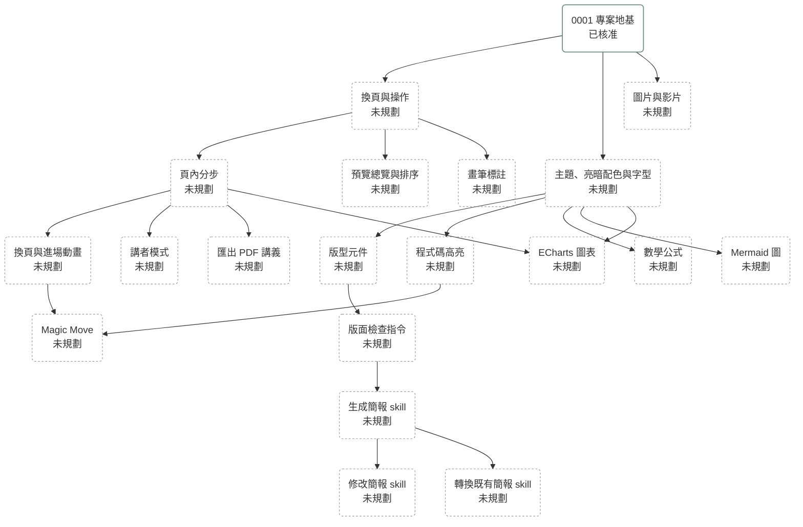

# Roadmap

<!-- 圖與願景段落的寫法見 sdd skill 的「Roadmap Conventions」一節。 -->

## 總覽

## 功能願景

### 專案地基

建立工具鏈，以及一個在三種場地（GitHub Pages、本機 static server、直接開啟 `file://`）都能播放的骨架。

1. [0001 專案地基：工具鏈與可播放的骨架](0001-project-foundation.md)

### 播放器

讓講者在任何場地都能用鍵盤、翻頁器或觸控播放簡報，並在現場臨時調整內容。

1. 換頁與操作：用鍵盤、翻頁器與觸控滑動換頁，支援跳頁、黑畫面與全螢幕。播放器把 slide ID 與步驟寫在網址的 hash 裡（例如 `#/intro/2`），所以調整頁面順序後，舊連結仍然指向同一頁。
2. 頁內分步：由播放器統一處理「下一步」，這頁的步驟走完才換頁。
3. 換頁與進場動畫：播放器提供一組預設效果，每一頁用效果的名稱挑選要用哪一種，沒有挑選的頁面套用 `deck.json` 指定的效果。
4. Magic Move：換頁時，前後兩頁都有的元素從前一頁的位置移動到後一頁的位置，一般元素與程式碼都支援。程式碼的動畫在建置時先算好，播放時不載入 Shiki。
5. 預覽總覽與排序：在本機開發時，拖曳排序的結果寫回 `deck.json`；在其他環境，新的順序與隱藏的頁面存在這台電腦的瀏覽器裡。
6. 畫筆標註：在頁面上疊一層 canvas，換頁後清除。

### 講者模式

講者在筆電上看到備註、下一頁與經過時間，投影幕只顯示簡報。

1. 講者模式：播放器另外開一個講者視窗，顯示目前頁、下一頁、備註與經過時間，兩個視窗的頁碼保持同步。備註寫在每一頁的 TSX 檔裡。

### 主題與版型

讓 AI 不寫 CSS 也能排出一致的版面，並讓講者依現場光線切換配色。

1. 主題、亮暗配色與字型：顏色、字型、字級定義成 Tailwind 的 `@theme` token，個別簡報可以覆寫部分 token，播放時可以切換亮暗配色。建置時依簡報內容切出用到的字，把字型打包進簡報包。
2. 版型元件：提供標題頁、雙欄等常見版面的元件。

### 內容類型

讓簡報能放進技術演講與授課常用的內容，而且全部可以離線播放。

1. 圖片與影片：素材放在簡報目錄的 `assets/`。
2. 程式碼高亮：用 Shiki 在建置時完成 tokenize。
3. 數學公式：用 KaTeX 在建置時 render 成 HTML。
4. Mermaid 圖：播放器在播放時 render Mermaid 圖，並在簡報開啟之後才載入 Mermaid 的 library，所以 Mermaid 不會拖慢簡報開啟的速度。
5. ECharts 圖表：圖表動畫配合頁內分步播放，縮圖與講者視窗裡的圖表關閉動畫。圖表用 SVG renderer，因為畫布放大到 4K 螢幕時，canvas renderer 畫出來的圖會模糊。

### 匯出 PDF 講義

主辦單位要講義時，講者從瀏覽器把簡報列印成 PDF。

1. 匯出 PDF 講義：每頁印成一張，有分步的頁面印出最後一步。

### AI 製作

讓 AI agent 用盡量少的 token 製作與修改簡報。Skill 用英文撰寫，放在 `.agents/skills/`，再在 `.claude/skills/` 建 symlink 指向這些 skill。

1. 版面檢查指令：用 Playwright 逐頁檢查超出畫布、文字溢出、元素重疊、字級過小、寫死的顏色，以及頁面實際的步驟數與頁面宣告的步驟數不符，並用文字回報。使用者指定某一頁時，AI 才截圖檢查那一頁。
2. 生成簡報 skill：從主題、大綱或逐字稿生成整份簡報與講者備註。
3. 修改簡報 skill：修改單頁、插入頁面、調整局部內容。
4. 轉換既有簡報 skill：把 pptx 或 Markdown 的文字、圖片、備註與頁面結構轉成本框架的格式，不追求版面和原檔相同。
