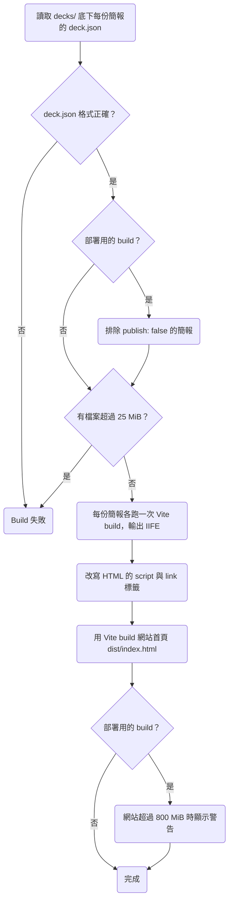

# 技術架構

<!-- 只寫 `main` branch 上已經實作的架構。設計理由寫在相關段落旁，寫出理由與放棄的做法，並連結到 archive 裡的 plan。 -->

## 技術選型

| 項目 | 選擇 |
| --- | --- |
| 頁面 | React 元件（TSX），用 Vite build |
| 樣式 | Tailwind CSS |
| 語言 | TypeScript 6.0 |
| 執行環境 | Node 24，版本寫在 `.nvmrc` |
| 套件管理 | pnpm，版本寫在 `package.json` 的 `packageManager` |
| Lint 與格式 | ESLint 與 Prettier |
| 測試 | Vitest 跑 unit test 與 integration test，Playwright 跑 E2E test |

講者與 AI agent 都從 `Makefile` 執行指令，指令列表見 `README.md`。

### 頁面

> 設計理由：每頁寫成 React 元件，AI 修改一頁時只需要讀寫一個檔案。曾考慮每頁是一份獨立的 HTML，由播放器用 iframe 載入，但預覽總覽要同時開幾十個 iframe，播放器也只能透過 `postMessage` 控制頁內分步；也考慮過把 HTML 片段注入 Shadow DOM，但片段裡的 `<script>` 不會自動執行，也沒有型別檢查。完整討論見 [0001](../plans/archive/0001-project-foundation.md)。

### 樣式

> 設計理由：主流模型都熟悉 Tailwind，skill 不必說明樣式怎麼寫。CSS Modules 讓 AI 每改一頁都要讀寫兩個檔案；只透過框架元件的 props 設定樣式的話，框架要設計一整套樣式 API，並寫進每次都會載入的 skill。完整討論見 [0001](../plans/archive/0001-project-foundation.md)。

### 語言

> 設計理由：TypeScript 7 改用 Go 實作，型別檢查比較快，但 typescript-eslint 的 type-aware 規則還不支援 TypeScript 7，所以 TypeScript 固定在 6.0。完整討論見 [0001](../plans/archive/0001-project-foundation.md)。

### 執行環境

`src/build/` 的 build script 用 TypeScript 撰寫，由 Node 24 直接執行。Node 只會移除型別註記，不會轉譯程式碼，所以這些檔案不能用 `enum`、`namespace` 這類需要轉譯的語法，relative import 也要寫出 `.ts` 副檔名；`tsconfig.node.json` 開啟 `erasableSyntaxOnly` 與 `allowImportingTsExtensions`，所以 `make typecheck` 會擋下需要轉譯的語法，以及沒有寫出 `.ts` 副檔名的 relative import。瀏覽器端的程式碼由 Vite 轉譯，型別檢查用 `tsconfig.app.json`。

> 設計理由：Node 24 本身就能執行 TypeScript，所以不安裝 `tsx`。之後需要 decorator 或 path alias 時再改用 `tsx`。完整討論見 [0001](../plans/archive/0001-project-foundation.md)。

### Lint 與格式

> 設計理由：曾考慮用 Biome 處理 lint 與格式化，但 ESLint 的 plugin 選擇比較多。完整討論見 [0001](../plans/archive/0001-project-foundation.md)。

### 測試

`make check` 依序執行 lint、型別檢查與 Vitest 的測試，E2E test 另外由 `make e2e` 執行。

> 設計理由：E2E test 要先 build 測試用的簡報，執行時間也比較長，所以不放進 `make check`。完整討論見 [0001](../plans/archive/0001-project-foundation.md)。

## 模組劃分

```text
.
├── decks/
│   └── <deck-id>/
│       ├── deck.json           標題、publish、頁面順序
│       ├── slides/
│       │   └── <slide-id>.tsx  每一頁一個 TSX 檔
│       └── assets/             圖片、影片等素材
├── src/
│   ├── build/                  Build script、dev server 與 Vite plugin
│   ├── player/                 播放器
│   └── site/                   網站首頁
├── tests/
│   ├── unit/                   Vitest 的 unit test
│   ├── integration/            Vitest 的 integration test
│   ├── e2e/                    Playwright 的 E2E test
│   └── fixtures/
│       └── decks/              測試用的簡報
└── dist/                       Build 出來的檔案，不 commit 進 git
    ├── index.html              網站首頁
    ├── _assets/                網站首頁的 JS 與 CSS
    └── <deck-id>/              一份簡報的 slidetray
```

所有測試集中在 `tests/`，依種類分成 `unit/`、`integration/`、`e2e/`；測試用的簡報放在 `tests/fixtures/decks/`。

> 設計理由：測試集中在 `tests/`，瀏覽專案時程式碼與測試不會混在一起。曾考慮把 unit test 放在被測的程式碼旁邊，方便找到某個模組的測試，但測試的名稱以需求 ID 開頭，用需求 ID 一樣找得到測試；而且 integration test 與 E2E test 跑的是完整的 build，不屬於任何一個模組，只能放在獨立的目錄，三種測試會變成兩套放法。測試用的簡報不放進 `decks/`，部署用的 build 才不會把這些簡報發布到網站上。完整討論見 [0001](../plans/archive/0001-project-foundation.md)。

### 簡報目錄

所有簡報都和框架的程式碼放在本 repo，每份簡報是 `decks/` 底下的一個目錄，目錄的格式寫在 [framework.md](framework.md)。

> 設計理由：改框架時，型別檢查會一起檢查所有簡報。曾考慮把框架發布成 npm 套件，讓每份簡報各自放在一個 repo；也考慮過把所有簡報集中放在另一個 repo。完整討論見 [0001](../plans/archive/0001-project-foundation.md)。

圖片、影片等素材放在簡報目錄的 `assets/`，直接 commit 進 git，單一檔案的大小上限寫在 [distribution.md](distribution.md) 的 DIST-R6。

> 設計理由：曾考慮用 Git LFS 存放素材，但不論素材有沒有用 Git LFS 存放，GitHub Pages 的網站大小上限都是 1 GB，而且每次部署時 GitHub Actions 下載 Git LFS 的檔案都會消耗 Git LFS 的頻寬額度。完整討論見 [0001](../plans/archive/0001-project-foundation.md)。

### 程式碼

- `src/build/cli.ts` 是 `make build`、`make build-site` 與 `make dev` 的入口。
- `src/build/plugins.ts` 的 Vite plugin 提供兩個 virtual module：`virtual:deck` 依 `deck.json` 的順序匯入一份簡報的每一頁，`virtual:site` 提供網站首頁要列出的 deck ID 與標題。
- `src/player/` 是 Vite 的入口 HTML 與播放器元件，負責把畫布縮放到視窗大小（PLAY-R2）。
- `src/site/` 是網站首頁的入口 HTML 與 React 元件。

> 設計理由：網站首頁用 React 與 Vite build，因為 roadmap 的「網站首頁」要沿用簡報的主題，首頁之後一定要經過 Vite build；曾考慮由 build script 直接產生靜態 HTML。完整討論見 [0001](../plans/archive/0001-project-foundation.md)。

`make dev DECK=<deck-id>` 啟動的 Vite dev server 只預覽一份簡報，和 build 這份簡報時用同一份 Vite 設定。`Makefile` 的 `DECKS_DIR` 變數預設是 `decks`；開發播放器時，執行 `make dev DECKS_DIR=tests/fixtures/decks DECK=<deck-id>`，用測試用的簡報預覽。

> 設計理由：每次 Vite build 只處理一份簡報，如果要讓一個 dev server 包含所有簡報，得另外寫 middleware 把 `/<deck-id>/` 對應到各自的入口，這段程式碼在 build 裡沒有對應的部分，所以 dev server 一次只預覽一份。完整討論見 [0001](../plans/archive/0001-project-foundation.md)。

## 資料流

本機 build 與部署用的 build 共用下圖的流程。



每份簡報各跑一次 Vite build，所以 slidetray 之間不共用任何檔案，任何一個 slidetray 都能單獨複製到隨身碟。網站首頁的 JS 與 CSS 放在 `dist/_assets/`；deck ID 不能包含 `_`（FRAME-R3），所以 `dist/_assets/` 不會和任何 slidetray 同名。

每份簡報跑 Vite build 時，Tailwind 只掃描 `src/player/` 與這份簡報的目錄，所以 slidetray 的 CSS 不會混入其他簡報用到的 class。Tailwind 依檔案掃描、不看 import 關係，所以 `slides/` 裡沒有列在 `deck.json` 的頁面雖然不會打包進 slidetray 的 JS，用到的 class 仍會寫進 CSS。

> 設計理由：曾考慮在 build 時沿著 `virtual:deck` 的 import 關係，只讓 Tailwind 掃描打包進 slidetray 的檔案，但 `diapo:deck` plugin 要先載入所有頁面，才能決定要在 player 的 stylesheet 加上哪些 `@source`；而且 dev server 如果照舊掃描整個簡報目錄，dev 與 build 的 CSS 會不一致。沒有列在 `deck.json` 的頁面用到的 class 通常只會讓 CSS 多出幾條規則，只有 `content-['…']` 這類 arbitrary value 裡的文字會被 Tailwind 寫進 CSS，而頁面的程式碼本來就公開在 repo 裡。完整討論見 [0001](../plans/archive/0001-project-foundation.md)。

## 部署方式

同一個 slidetray 可以部署在 GitHub Pages、用 `make serve` 在本機的 static server 播放，或直接用瀏覽器開啟 `file://` 的 `index.html`。從 `file://` 開啟的網頁 origin 是 `null`，所以 build 照下面的方式產生 slidetray：

- Vite 輸出 IIFE 格式的單一 JS 檔，再把 HTML 裡的 `<script type="module" crossorigin>` 改寫成 `<script defer>`，並移除 `<link>` 標籤的 `crossorigin` 屬性。
- Vite 在 IIFE 格式下預設會把 CSS 寫進 JS，由 JS 在執行時把 CSS 插入頁面，這時 CSS 裡 `url()` 的相對路徑會改以 HTML 的位置計算，所以 build 把 CSS 輸出成獨立的檔案。
- 所有資源都用相對路徑（Vite 的 `base` 是 `./`），所以 slidetray 搬到其他位置，或網站部署在子路徑下時，瀏覽器都能載入這些資源。
- HTML 設定空的 favicon，讓瀏覽器不會對 slidetray 以外的 `/favicon.ico` 送出 request。

> 設計理由：曾考慮用 `vite-plugin-singlefile` 把所有檔案內嵌進一個 HTML，但 `vite-plugin-singlefile` 會把影片轉成 base64 塞進 HTML。IIFE 格式的代價是不能使用 `import.meta` 與 top-level await，也不能做 code splitting。完整討論見 [0001](../plans/archive/0001-project-foundation.md)。

以下是在 Chromium、Firefox、WebKit 實測過的 `file://` 行為，之後寫 plan 時不必重新查證：

- 外部的 `<script type="module">`、`import()`、`fetch()`，以及帶 `crossorigin` 屬性的 script 與 stylesheet 都會被擋下。
- 字型用相對路徑可以載入。
- `localStorage` 在 Chromium 與 WebKit 由所有 `file://` 網頁共用，在 Firefox 則每個檔案路徑各自有一份。
- 兩個視窗之間用 `window.open` 加 `postMessage` 可以通訊，`BroadcastChannel` 在 WebKit 收不到訊息。

`make dev` 用 Vite 的 dev server 透過 HTTP 載入 ES module，載入方式和 build 出來的檔案不同，所以 E2E test 一律測 build 出來的檔案。Playwright 內建的 Firefox 預設把 `security.fileuri.strict_origin_policy` 設成 `false`，和正式版的 Firefox 相反，所以 `playwright.config.ts` 把這個設定改回 `true`。

GitHub Actions 的 workflow 放在 `.github/workflows/`：

| Workflow | 觸發時機 | 做什麼 |
| --- | --- | --- |
| `ci.yml` | PR 開啟或更新時 | 依序執行 `make install`、`make check`、`make build-site`、`make e2e`；PR 只改 `.md` 檔時全部跳過 |
| `deploy.yml` | Merge 到 `main` 時 | 依序執行 `pnpm install`、`make build-site`，再透過 GitHub Actions 的 Pages 部署流程把 `dist/` 部署到 GitHub Pages |

> 設計理由：`make check`、`make build-site` 與 `make e2e` 都不檢查 Markdown，所以只改 `.md` 檔的 PR 跳過 `ci.yml` 的所有步驟。改到其他檔案的 PR 每次更新都跑 E2E test，因為 E2E test 在本機跑完不到 10 秒，CI 上比較花時間的是下載瀏覽器，而且 public repo 用 GitHub Actions 的標準 runner 不用付費。曾考慮用 PR 的 label 觸發 E2E test，並把 E2E test 設成 merge 的條件，但 merge 條件看的是 PR 最新的 commit，所以開 PR 的人每次 push 之後都要重新加一次 label；GitHub 的 merge queue 能在 merge 前才跑 E2E test，但只開放給 organization 擁有的 repo。完整討論見 [0001](../plans/archive/0001-project-foundation.md)。

`make e2e` 會自己 build `tests/fixtures/decks/`，所以 `ci.yml` 裡的 `make build-site` 只負責確認 `decks/` 的部署用 build 能成功。`deploy.yml` 用 `pnpm install` 安裝套件，不執行 `make install`，所以部署時不會下載 Playwright 的瀏覽器。

> 設計理由：`deploy.yml` 不再跑一次測試，因為同樣的測試已經在 PR 上跑過。完整討論見 [0001](../plans/archive/0001-project-foundation.md)。
